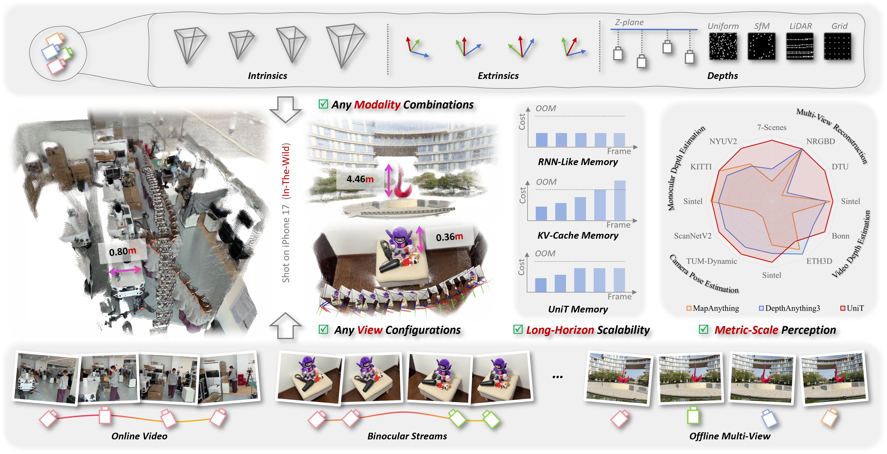

# UniT: Unified Geometry Learning with Group Autoregressive Transformer

<p align="center">
  Haotian Wang, Yusong Huang, Zhaonian Kuang, Hongliang Lu, Xinhu Zheng, Meng Yang, and Gang Hua
</p>

<p align="center">
  <a href="#"></a>
  <a href="https://sc2i-hkustgz.github.io/UniT/"></a>
  <a href="https://enceladush-unit.hf.space/"></a>
</p>

<!-- Replace the remaining placeholder href="#" above with the arXiv URL. -->

## News

- **2026-05-21:** Paper, project page, and Hugging Face demo are released.

## Overview

<p align="center">
  
</p>

UniT is a unified feed-forward model that reformulates a wide range of geometry perception capabilities into a single framework, covering diverse *view configurations*, *modality combinations*, *metric-scale perception*, and *long-horizon scalability*. It supports both online and offline inference over an arbitrary number of views, flexibly incorporates auxiliary modalities such as camera parameters and depth maps, recovers geometry in metric scale measured in meters, and maintains bounded complexity over long horizons in in-the-wild environments.

## Availability

The paper is currently under review, and the code is not publicly available at this stage. In the meantime, we provide a Hugging Face demo for testing UniT.

## Citation

If you find UniT useful in your research, please consider citing:

```bibtex
@article{unit,
  title={UniT: Unified Geometry Learning With Group Autoregressive Transformer},
  author={Wang, Haotian and Huang, Yusong and Kuang, Zhaonian and Lu, Hongliang and Zheng, Xinhu and Yang, Meng and Hua, Gang},
  journal={arXiv preprint},
  year={2026}
}
```
